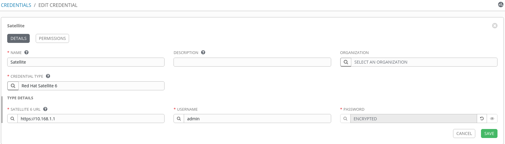
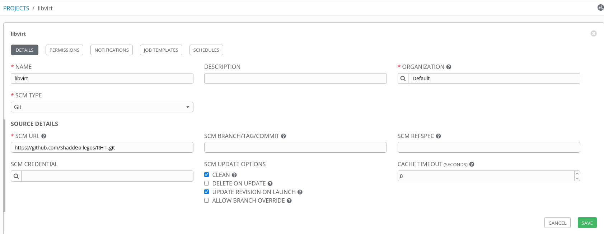
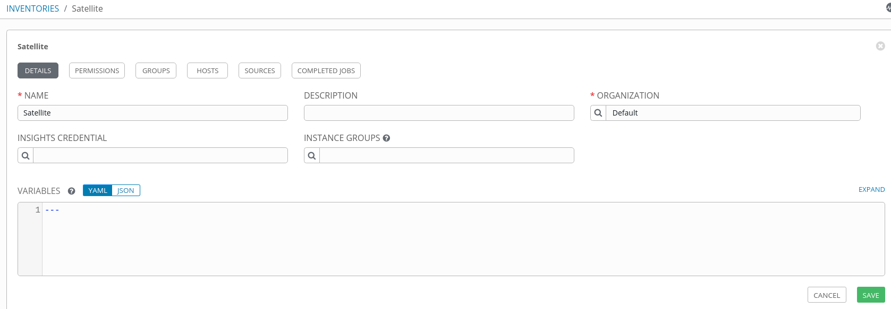
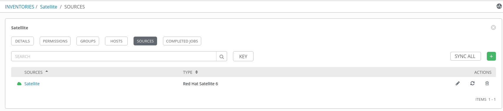
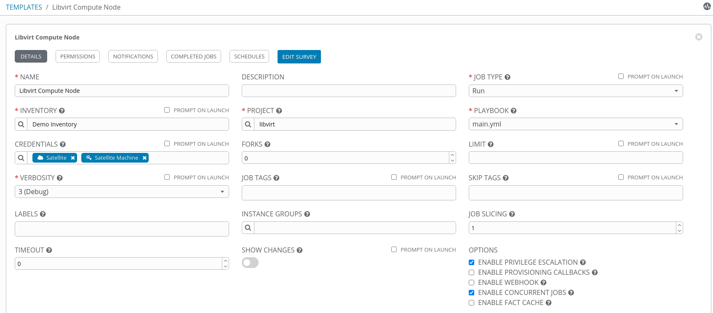

# Simple Ansible and Satellite Integration ASI - Proof of Concept

These playbooks use Satellite API to create a node in libvirt 

Satellite then provisions the node 

## What you need
-----

### ANSIBLE

 * Ansible Tower
 * Ansible 2.9 or later
 * Dynamic inventory 
 * Libvirt host
 * These playbooks [ASI](./ASI) 
 * Project
 * Satellite 6 Credential
 * Machine Credential to manage nodes
 * Template calling 
        main.yml
        Work flow templates (optional)  
 * Survey for:
        sat_server_url: "{{ SATFQDN }}"   <-- should be FQDN or ip (https://sat.example.com or https://10.168.0.1)
        sat_password: "{{ SATPASSWORD }}" <-- Uses the service user "admin" account that you sign into satellite with 
        name: "{{ newnodez }}"            <-- shortname node to create

### SATELLITE

 * A Satellite 6.7 server (or later)
 * Compute Resources (libvirt) 
 * DHCP
 * DNS
 * tftp

### LIBVIRT

## Setup Ansible Tower
-----
For convenience sake I have provided a script that will automatically install a single node Proof of Concept type system 

[Requirements](https://docs.ansible.com/ansible-tower/latest/html/installandreference/requirements_refguide.html) for Ansible Tower 
        
        eth0 -- Internal network for building, managing, and provisioning nodes
        eth1 -- External so you can get things from the internet like the bundled installer or use the analytics or other tools at cloud.redhat.com
 
        35GB Storage
        4GB RAM
        2 CPU
 
        / root Rest of drive 
        /boot  1024MB 
        /swap  6GB 

        Red Hat Enterprise Linux 8.2 or later 64-bit (x86)
        Red Hat Enterprise Linux 7.7 or later 64-bit (x86)

#### Requirements to setup Ansible Tower

        1. Download the script
             
             wget https://github.com/ShaddGallegos/RHTI/raw/master/Ansible_Tower/ANSIBLE_TOWER-3.7.1-1-INSTALLER.sh 
             
                 What this script does 
                    This installer will work on RHEL 7 or RHEL 8 and:
                    1. Verify you are root 
                    2. Check you are connected to the internet.
                    3. Provide a breif overview of what the tool is.
                    4. Help the end user register with Red Hat if not already done.
                    5. Take of some prep stuff install shut off firewall and selinux and install pip prior to install.
                    6. Enable required repos for OS and Ansible Tower.
                    7. Upgrades the OS.
                    8. Installs the dependencies from the bundle forces them to requirement levels listed in bundle.
                    9. Installs Tower. (Queries user for tower password) 
                    10. Gives the end user the option to enable firewall and selinux.
         
        2. Change to root user
    
             sudo su

        3. Run the script

             sh ANSIBLE_TOWER-3.7.1-1-INSTALLER.sh
        
        Enter Password when prompted

        After you set the password you can walk away and 
        Takes 15-20 min to install Ansible Tower

## Configuring

-----

        Credentials are utilized by Tower for authentication when launching Jobs against machines, synchronizing 
        with inventory sources, and importing project content from a version control system.

        You can grant users and teams the ability to use these credentials, without actually exposing the credential to 
        the user. If you have a user move to a different team or leave the organization, you don’t have to re-key all of 
        your systems just because that credential was available in Tower.

-----

        A Project is a logical collection of Ansible playbooks, represented in Tower.

        You can manage playbooks and playbook directories by either placing them manually under the Project Base Path 
        on your Tower server, or by placing your playbooks into a source code management (SCM) system supported by Tower, 
        including Git, Subversion, Mercurial, and Red Hat Insights. To create a Red Hat Insights project, refer to Setting 
        up an Insights Project.

-----

        An Inventory is a collection of hosts against which jobs may be launched, the same as an Ansible inventory file. 
        Inventories are divided into groups and these groups contain the actual hosts. Groups may be sourced manually, by 
        entering host names into Tower, or from one of Ansible Tower’s supported cloud providers.
        
        To configure the source for the inventory:

                In the inventory you want to add a source, click the Sources tab.

                Click the green + add button.

----- 

        Inventory sources are no longer associated with groups. Prior to Ansible Tower 3.2, spawned groups and hosts would 
        be children of our inventory source group. Now, spawned groups are top-level. These groups may still have child 
        groups, and all of these spawned groups may have hosts.

        Adding a source to an inventory only applies to standard inventories. Smart inventories inherit their source 
        from the standard inventories they are associated with. 

-----

        You should be back at the previous menu now, select the sercular arrows (icon) below "ACTIONS" on the right side

-----

        A job template is a definition and set of parameters for running an Ansible job. Job templates are useful to execute 
        the same job many times. Job templates also encourage the reuse of Ansible playbook content and collaboration between 
        teams. While the REST API allows for the execution of jobs directly, Tower requires that you first create a job template.

[Setting Up Libvirt Host](./libvirt)
[Setting Up Satellite Host](./Satellite)

