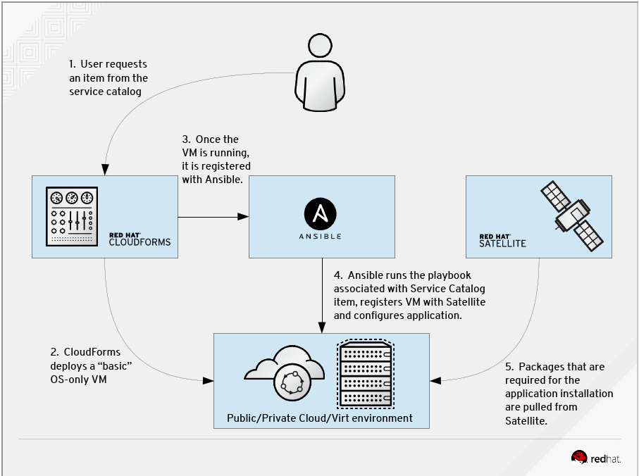

* Table of contents below Intro, for Tools and Docs

# RED HAT MANAGEMENT PORTFOLIO
In every environment there is a core set of servers/services that are required to allow your users to interface with the systems they use daily in seamless operation. The Red Hat Management Portfolio can provide you with the tools you need from a User Front End, Provisioning, Orchestration, Automation, and Management for your environment. These systems will allow you to provide that next level of IT service to your end users/customers. 

My work is focused on: 
* Ansible Tower
* Satellite
* InSights

The key to success is always in the planning! The venn diagram below depicts the primary functions between tools and the overlap between to help you decide where you would like to situate the functions, and assist in integrating the tools within your IT environment(s) 
## Satellite: 
The easiest way to manage your Red Hat infrastructure for efficient and compliant IT operations. Establish trusted content repos and processes that help you build a standards-based, secure Red Hat environment. 
## Ansible Tower: 
Simple, agentless automation platform that can improve your current processes, migrate apps for better optimization, and provide a single language for DevOps practices across your organization. Ansible Tower by Red Hat is a centralized API for your Ansible automation and a graphical user interface for Ansible.
## InSights: 
A predictive analytic tool with real-time, in-depth analysis of your Red Hat infrastructure, letting you predict and prevent problems before they occur.

Working in tandem, this is what the optimal Management system would look like from a Red Hat perspective.

## Table of Contents

[1. Ansible Tower](./Ansible_Tower)

        Ansible and Ansible Tower should be the linchpin in your Enterprise and the foundation for your your journey into automation

        Ansible can:

           * Get you started on your way to automation of everything.
           * Has a lower cost of implamentation (easy to learn/master).
           * Anybody can do it.  
           * Ansible will reduce: development time, operations costs, time to 
             market, suppot costs, delivery/expense costs and time on site.
           * Ansible Tower will help build better customer relationships, increase 
             margin, allow you to franchise your Playbooks, Roles, 
             or Collections bringing in revinue streams (internal or external) 
             to your Enterprise or Organization within.
           * As an individual this is a tool that you can put in your tool bag 
             that can replace just about every management, orchastration, admin 
             tool out there (Windows, Linux, Unix, IoT) just think of the opportunity you create for yourself.
           * Best part Ansible is free, Ansible Tower comes at a cost 
             however you can request a license for personal use to manage upto 10 nodes FOREVER for FREE, 
             Or for your Enterprise you can request an eval at the link below. Check it out I really think it is worth your time.            

 ** [Request a Ansible Tower License](https://www.redhat.com/en/technologies/management/ansible/try-it?extIdCarryOver=true&sc_cid=701f2000001OH6uAAG)
 
 * [Ansible_Cheat_Sheets](./Ansible_Tower/Ansible_Cheat_Sheets) - Training vendors with nice wall cheat sheets for ansible visit their sites if you want more info
 * [Ansible_DOC](./Ansible_Tower/Ansible_DOC)
 * [Ansible_PDF](./Ansible_Tower/Ansible_PDF)
 * [Ansible_PPT](./Ansible_Tower/Ansible_PPT)
 * [Ansible Use Cases](https://bitbucket.org/ShaddGallegos/redhattoolsinstaller/raw/0c291ee9fd53093599a7f6ed8762cf4b7ad985c4/Ansible_Tower/Ansible_Use_Cases/Ansible%20Use%20Case%20List.xlsx) - Downloads the xls spread sheet
 * [Ansible_Video_Demos](./Ansible_Tower/Ansible_Video_Demos)
 * [Ansible Playbook Examples](./Ansible_Tower/Ansible_Resources/ANSIBLE_GITHUB.md )
 * [Ansible Galaxy Roll Examples](./Ansible_Tower/Ansible_Resources/ANSIBLE_GALAXY.md )
 * [Ansible, from the Commandline](./Ansible_Tower/Ansible_Resources/ANSIBLE_COMMANDLINE.md)

#### Simple Scripts for installing Ansible Tower P.O.C on a single node/vm on RHEL7/8:
        NOTE: Ansible Tower is one of the easiest things to install at Red Hat the 
              scripts below are something I made to help a windows person install Ansible Tower 
              on a linux system without thought. The scripts only install on a standalone if you 
              are going to install this in an Enterprise environment you need to 
              look at the architectural recomendations at: 
              https://docs.ansible.com/ansible-tower/latest/html/administration/clustering.html

###### THE ARCHITECTURE FOR AN ENTERPRISE DEPLOYMENT

        DISCLAMER: Also these are "my scripts" and are not supported in any way (use at own risk) 
                   Do not use on a currently running production system. No implied warrenty or other.
 
 * [ANSIBLE_TOWER-3.6.4-1-INSTALLER.sh](https://bitbucket.org/ShaddGallegos/redhattoolsinstaller/raw/0c291ee9fd53093599a7f6ed8762cf4b7ad985c4/Ansible_Tower/ANSIBLE_TOWER-3.6.4-1-INSTALLER.sh)
 * [ANSIBLE_TOWER-3.7.0-4-INSTALLER.sh](https://bitbucket.org/ShaddGallegos/redhattoolsinstaller/raw/0c291ee9fd53093599a7f6ed8762cf4b7ad985c4/Ansible_Tower/ANSIBLE_TOWER-3.7.0-4-INSTALLER.sh)

[2. Internet Resources](./Ansible_Tower/Ansible_Resources/Internet_Resources/README.md) - Vendor specific resources all in one spot.
  
[3. Redhat Workshops](https://github.com/ansible/workshops) - Code for building workshops.

#### Instructor-led Workshops

6 hour workshops:

| Workshop   | Presentation Deck  | Exercises  | Workshop Type Var   |
|---|---|---|---|
| **Ansible Red Hat Enterprise Linux Workshop**   focused on automating Linux platforms like Red Hat Enterprise Linux  | [Deck](https://github.com/ansible/workshops/raw/devel/decks/ansible_rhel.pdf) | [Exercises](https://github.com/ansible/workshops/tree/devel/exercises/ansible_rhel)  | `workshop_type: rhel`  |
| **Ansible Network Automation Workshop**   focused on router and switch platforms like Arista, Cisco, Juniper   | [Deck](https://github.com/ansible/workshops/raw/devel/decks/ansible_network.pdf) | [Exercises](https://github.com/ansible/workshops/tree/devel/exercises/ansible_network)  | `workshop_type: network`  |
| **Ansible F5 Workshop**   focused on automation of F5 BIG-IP  | [Deck](https://github.com/ansible/workshops/raw/devel/decks/ansible_f5.pdf) | [Exercises](https://github.com/ansible/workshops/tree/devel/exercises/ansible_f5)   | `workshop_type: f5` |
| **Ansible Security Automation**   focused on automation of security tools like Check Point Firewall, IBM QRadar and the IDS Snort  | [Deck](https://github.com/ansible/workshops/raw/devel/decks/ansible_security.pdf) | [Exercises](https://github.com/ansible/workshops/tree/devel/exercises/ansible_security)   | `workshop_type: security` |
| **Ansible Windows Automation Workshop**   focused on automation of Microsoft Windows  | [Deck](https://github.com/ansible/workshops/raw/devel/decks/ansible_windows.pdf) | [Exercises](https://github.com/ansible/workshops/tree/devel/exercises/ansible_windows)   | `workshop_type: windows` |

90 minute abbreviated versions:

| Workshop   | Presentation Deck  | Exercises  | Workshop Type Var   |
|---|---|---|---|
| **Ansible Red Hat Enterprise Linux Workshop**   focused on automating Linux platforms like Red Hat Enterprise Linux  | [Deck](https://github.com/ansible/workshops/raw/devel/decks/ansible_rhel_90.pdf) | [Exercises](https://github.com/ansible/workshops/tree/devel/exercises/ansible_rhel_90)  | `workshop_type: rhel_90`  |

#### Lab Provisioner
 - [AWS Lab Provisioner](https://github.com/ansible/workshops/tree/devel/provisioner) - playbook that spins up instances on AWS for students to perform the exercises provided above.

#### Self Paced Exercises

 - [Vagrant Demo](https://github.com/ansible/workshops/tree/devel/vagrant-demo) - Self-paced network automation exercises that can be run on your personal laptop

[4. Satellite](./Satellite)

 ** [Request Satellite License](https://www.redhat.com/en/technologies/management/smart-management)

        NOTE: Satellite has a lot of features so the request will be started with a conversation with 
              your sales person and the technical account team to assist in the archatecturewhen you request a evaluation 

 * [Satellite_PDF](./Satellite/Satellite_PDF)
 * [Satellite_DOC](./Satellite/Satellite_DOC)
 * [Satellite-Ansible Playbook Examples](./Satellite/Satellite-Ansible_Resources/GITHUB_FOR_SATELLITE.md)
 * [Satellite-Ansible Galaxy Roll Examples](./Satellite/Satellite-Ansible_Resources/ANSIBLE_GALAXY_FOR_SATELLITE.md)
#### RPM for an X enabled server (not required) 
 * xdialog-2.3.1-13.el7.centos.x86_64.rpm
#### Simple script checking the health of your Satellite once it is set up on your RHEL7 sys:
 * sat6_healthCheck.sh
#### Simple script for installing Satellite P.O.C on a single node/vm on RHEL7:

 * [REDHATTOOLSINSTALLER-6.7-4.sh](https://bitbucket.org/ShaddGallegos/redhattoolsinstaller/raw/4a5891a4674f9d46ea4ed5ebc2df67dbe36b1b84/Satellite/REDHATTOOLSINSTALLER-6.7-4.sh)
  
[5. Useful Scripts](./Useful_Scripts)

[6. intergrations](./Intergrations)

 * [Satellite/Ansible Tower](./Intergrations/Satellite-Ansible_Tower) - in Progress
 * [Ansible Tower/ServiceNow](./Intergrations/Ansible_Tower-ServiceNow) - in progress

more to come 
