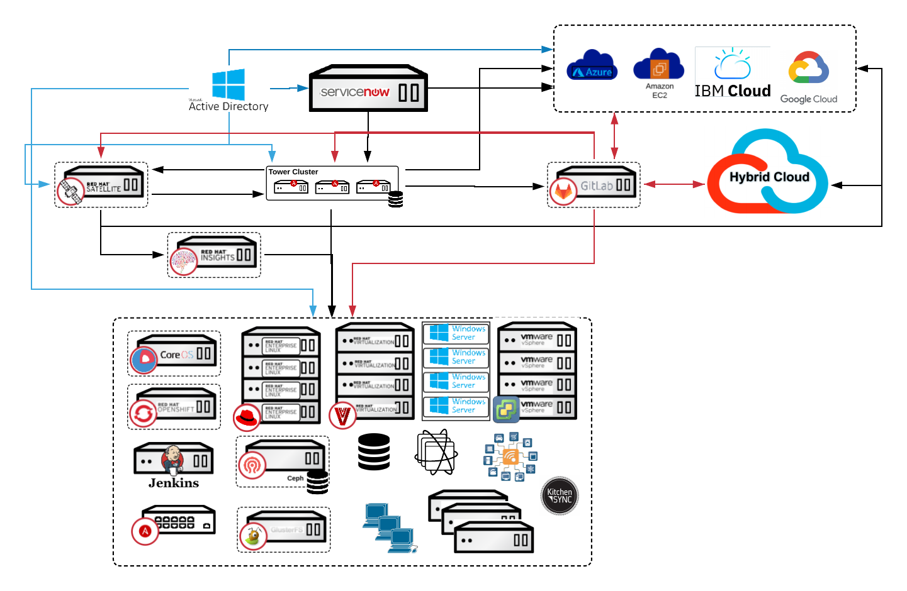
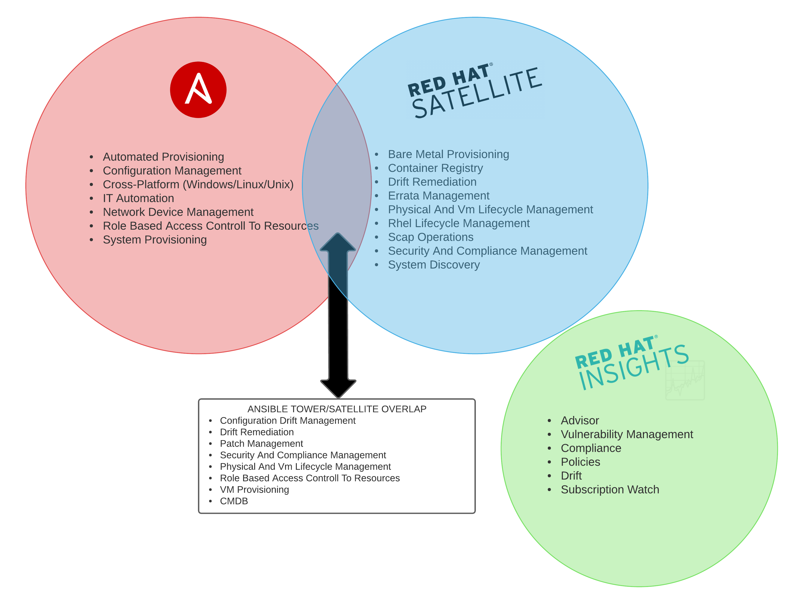
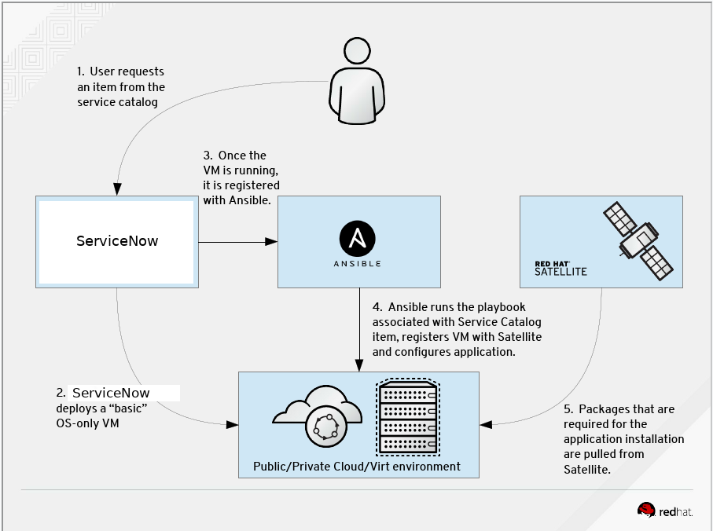
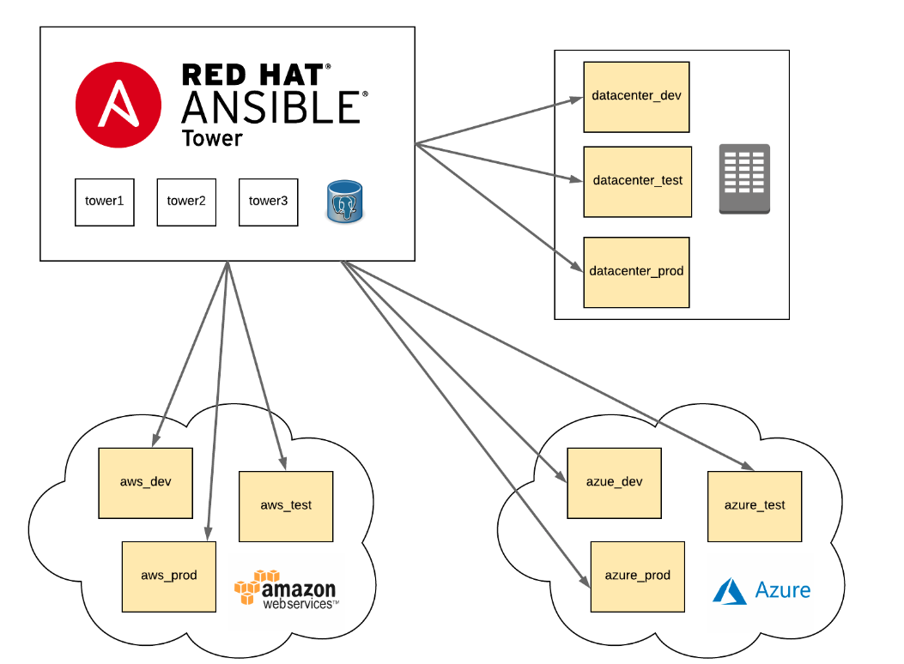
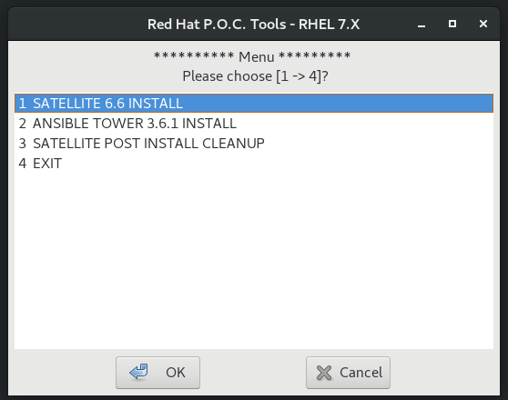

* Table of contents below Intro, for Tools and Docs

# RED HAT MANAGEMENT PORTFOLIO
In every environment there is a core set of servers/services that are required to allow your users to interface with the systems they use daily in seamless operation. The Red Hat Management Portfolio can provide you with the tools you need from a User Front End, Provisioning, Orchestration, Automation, and Management for your environment. These systems will allow you to provide that next level of IT service to your end users/customers. 

My work is focused on: 

 * Ansible Tower
 * Satellite
 * InSights

The key to success is always in the planning! The Venn diagram below depicts the primary functions between tools and the overlap between to help you decide where you would like to situate the functions, and assist in integrating the tools within your IT environment(s) 
## Satellite: 
The easiest way to manage your Red Hat infrastructure for efficient and compliant IT operations. Establish trusted content repos and processes that help you build a standards-based, secure Red Hat environment. 
## Ansible Tower: 
Simple, agentless automation platform that can improve your current processes, migrate apps for better optimization, and provide a single language for DevOps practices across your organization. Ansible Tower by Red Hat is a centralized API for your Ansible automation and a graphical user interface for Ansible.
## InSights: 
A predictive analytic tool with real-time, in-depth analysis of your Red Hat infrastructure, letting you predict and prevent problems before they occur.

Working in tandem, this is what the optimal Management system would look like from a Red Hat perspective.

---------------------------
[1. Ansible and Ansible Tower](./Ansible_Tower)
---------------------------

        While the upstream Ansible community is known for fast-moving innovations, many enterprises
        require a more secure, stable and reliable approach. With Ansible Engine, organizations
        can access the tools and innovations available from the underlying Ansible technology in a
        hardened, enterprise-grade manner. Ansible Engine relies on the massive, global community 
        behind the Ansible project, and adds in the capabilities and assurance from Red Hat that 
        your business requires in order to comfortably adopt organization-wide automation, and 
        at any scale you can bring. 

[Community vs. Enterprise](https://www.ansible.com/products/engine)

        Both the Ansible project and Ansible Engine are open source technologies. The Ansible project
        is built by the community (ansible.com/community) for the benefit of the community. 
        Ansible Engine is developed by Red Hat with the explicit intent of being used as an 
        enterprise IT platform.

        Automation requires an investment in time, technology, and people. Make the most of your 
        investment with an enterprise automation platform that delivers agility and flexibility.

[Ansible Tower](https://www.ansible.com/products/tower)

        Solve problems once. Scale automation with control and insight. Collaborate across teams. 
        Manage policy enforcement and governance. Bring the power of automation to your whole 
        organization.

        With Red Hat Ansible Tower you can centralize and control your IT infrastructure with a visual
        dashboard, role-based access control, job scheduling, integrated notifications and graphical 
        inventory management. Easily embed Ansible Tower into existing tools and processes with REST 
        API and CLI.

Ansible and Ansible Tower should be the linchpin in your Enterprise and the foundation for your
your journey into automation

Ansible Features:

  * Simple
  * Powerful - hundreds of use cases 
  * Agentless
  * Cross platform – Linux, Windows, UNIX, IoT, etc...
  * Human readable - anyone can do it (no coding skills required) 
  * Perfect description of application - less time on documentation required
  * Version controlled
  * Dynamic inventories
  * Orchestration that plays well with others – hp sa, puppet, Jenkins, rhnss, etc.
  * The language of DevOps
 
Ansible Tower Features:

  * Easy to understand and clean dashboard
  * Real-time job status updates
  * Multi-playbook workflows
  * Easy to see who ran what job when
  * Scale capacity with tower clusters
  * Integrated notifications
  * Schedule ansible jobs
  * Manage and track your entire inventory - Static or DYNAMIC INVENTORIES
  * Self-service it... simplified
  * Remote command execution
  * Comprehensive rest API and tower CLI tool
  * Role Based Access Control
  * LDAP, AD, and other authentication integration
  * Made easy config for your logging aggragator 

[Request a Ansible Tower License](https://www.redhat.com/en/technologies/management/ansible/try-it?extIdCarryOver=true&sc_cid=701f2000001OH6uAAG)

 * [Ansible_Cheat_Sheets](./Ansible_Tower/Ansible_Cheat_Sheets) - Training vendors with nice wall cheat sheets for ansible visit their sites if you want more info
 * [Ansible_DOC](./Ansible_Tower/Ansible_DOC)
 * [Ansible_PDF](./Ansible_Tower/Ansible_PDF)
 * [Ansible_PPT](./Ansible_Tower/Ansible_PPT)
 * [Ansible Use Cases](https://github.com/ShaddGallegos/RHTI/blob/master/Ansible_Tower/Ansible_Use_Cases/Ansible%20Use%20Case%20List.xlsx) - Downloads the xls spread sheet
 * [Ansible_Video_Demos](./Ansible_Tower/Ansible_Video_Demos)
 * [Ansible Playbook Examples](./Ansible_Tower/Ansible_Resources/ANSIBLE_GITHUB.md)
 * [Ansible Galaxy Roll Examples](./Ansible_Tower/Ansible_Resources/ANSIBLE_GALAXY.md)
 * [Internet Resources](./Ansible_Tower/Ansible_Resources/Internet_Resources/README.md) - Vendor specific resources all in one spot.
 * [Ansible, From The Command Line](./Ansible_Tower/Ansible_Resources/ANSIBLE_COMMANDLINE.md)

## What Comes with the Premium vs Standard versions of Ansible Tower?
 * [Ansible Tower Editions](https://www.ansible.com/products/tower/editions)

#### Simple Scripts for installing Ansible Tower P.O.C on a single node/vm on RHEL7/8:
        
        NOTE: Ansible Tower is one of the easiest things to install at Red Hat the 
              scripts below are something I made to help a windows person install Ansible Tower 
              on a linux system without thought. The scripts only install on a standalone if you 
              are going to install this in an Enterprise environment you need to 
              look at the architectural recomendations at: 
              https://docs.ansible.com/ansible-tower/latest/html/administration/clustering.html

###### THE ARCHITECTURE FOR AN ENTERPRISE DEPLOYMENT

        DISCLAMER: Also these are "my scripts" and are not supported in any way (use at own risk) 
                   Do not use on a currently running production system. No implied warrenty or other.
 
 * [ANSIBLE_TOWER-3.6.4-1-INSTALLER.sh](https://github.com/ShaddGallegos/RHTI/blob/master/Ansible_Tower/ANSIBLE_TOWER-3.6.4-1-INSTALLER.sh)
 * [ANSIBLE_TOWER-3.7.0-4-INSTALLER.sh](https://github.com/ShaddGallegos/RHTI/blob/master/Ansible_Tower/ANSIBLE_TOWER-3.7.0-4-INSTALLER.sh)
 * [ANSIBLE_TOWER-3.7.1-1-INSTALLER.sh](https://github.com/ShaddGallegos/RHTI/blob/master/Ansible_Tower/ANSIBLE_TOWER-3.7.1-1-INSTALLER.sh)

#### FREE Ansible Tower Workshops (listed below)
---------------------------------

 * Instructor-led (In person or remote)  - Contact your Red Hat Technical Account Manager, Account Solutions Architect, or Sales Team.
 * Or in true Red Hat/Opensource fashion, Red Hat provides you the code to set it up for yourself!

[Red Hat Workshops](https://github.com/ansible/workshops) - Code for building workshops.

6 hour workshops:

| Workshop   | Presentation Deck  | Exercises  | Workshop Type Var   |
|---|---|---|---|
| **Ansible Red Hat Enterprise Linux Workshop**   focused on automating Linux platforms like Red Hat Enterprise Linux  | [Deck](https://github.com/ansible/workshops/blob/devel/decks/ansible_rhel.pdf) | [Exercises](https://github.com/ansible/workshops/tree/devel/exercises/ansible_rhel)  | `workshop_type: rhel`  |
| **Ansible Network Automation Workshop**   focused on router and switch platforms like Arista, Cisco, Juniper   | [Deck](https://github.com/ansible/workshops/blob/devel/decks/ansible_network.pdf) | [Exercises](https://github.com/ansible/workshops/tree/devel/exercises/ansible_network)  | `workshop_type: network`  |
| **Ansible F5 Workshop**   focused on automation of F5 BIG-IP  | [Deck](https://github.com/ansible/workshops/blob/devel/decks/ansible_f5.pdf) | [Exercises](https://github.com/ansible/workshops/tree/devel/exercises/ansible_f5)   | `workshop_type: f5` |
| **Ansible Security Automation**   focused on automation of security tools like Check Point Firewall, IBM QRadar and the IDS Snort  | [Deck](https://github.com/ansible/workshops/blob/devel/decks/ansible_security.pdf) | [Exercises](https://github.com/ansible/workshops/tree/devel/exercises/ansible_security)   | `workshop_type: security` |
| **Ansible Windows Automation Workshop**   focused on automation of Microsoft Windows  | [Deck](https://github.com/ansible/workshops/blob/devel/decks/ansible_windows.pdf) | [Exercises](https://github.com/ansible/workshops/tree/devel/exercises/ansible_windows)   | `workshop_type: windows` |

90 minute abbreviated versions:

| Workshop   | Presentation Deck  | Exercises  | Workshop Type Var   |
|---|---|---|---|
| **Ansible Red Hat Enterprise Linux Workshop**   focused on automating Linux platforms like Red Hat Enterprise Linux  | [Deck](https://github.com/ansible/workshops/blob/devel/decks/ansible_rhel_90.pdf) | [Exercises](https://github.com/ansible/workshops/tree/devel/exercises/ansible_rhel_90)  | `workshop_type: rhel_90`  |

#### Lab Provisioner
 - [AWS Lab Provisioner](https://github.com/ansible/workshops/tree/devel/provisioner) - Playbook that spins up instances on AWS for students to perform the exercises provided above.

#### Self Paced Exercises

 - [Vagrant Demo](https://github.com/ansible/workshops/tree/devel/vagrant-demo) - Self-paced network automation exercises that can be run on your personal laptop

---------------------------
[2. Satellite](./Satellite)
---------------------------

        Red Hat Satellite is a system management solution that enables you to deploy, configure,
        and maintain your systems across physical, virtual, and cloud environments. Satellite 
        provides provisioning, remote management and monitoring of multiple Red Hat Enterprise Linux
        deployments with a single, centralized tool.

        Red Hat Satellite Server synchronizes the content from Red Hat Customer Portal and other 
        sources, and provides functionality including fine-grained life cycle management, user and 
        group role-based access control, integrated subscription management, as well as advanced GUI, 
        CLI, or API access.

        Red Hat Satellite Capsule Server mirrors content from Red Hat Satellite Server to facilitate 
        content federation across various geographical locations. Host systems can pull content and
        configuration from the Capsule Server in their location and not from the central Satellite
        Server. The Capsule Server also provides localized services such as Puppet Master, DHCP, DNS,
        or TFTP. Capsule Servers assist you in scaling Red Hat Satellite as the number of managed 
        systems increases in your environment.
       
       [ACCESS RED HAT SATELLITE](https://access.redhat.com/documentation/en-us/red_hat_satellite/6.7/html/release_notes/pref-red_hat_satellite-release_notes-introduction#red_hat_satellite_and_proxy_server_life_cycle)
        

 ** [Request Satellite License](https://www.redhat.com/en/technologies/management/smart-management)

 * [Whats components comprise Satellite?](https://access.redhat.com/articles/1343683)

        NOTE: Satellite has a lot of features so the request will be started with a conversation with
              your sales person and the technical account team to assist in the archatecturewhen
              you request a evaluation.

 * [Satellite_PDF](./Satellite/Satellite_PDF)
 * [Satellite_DOC](./Satellite/Satellite_DOC)
 * [Satellite-Ansible Playbook Examples](./Satellite/Satellite-Ansible_Resources/GITHUB_FOR_SATELLITE.md)
 * [Satellite-Ansible Galaxy Roll Examples](./Satellite/Satellite-Ansible_Resources/ANSIBLE_GALAXY_FOR_SATELLITE.md)
#### RPM for an X enabled server (not required) 
 * [xdialog-2.3.1-13.el7.centos.x86_64.rpm](./Satellite/)
#### Simple script checking the health of your Satellite once it is set up on your RHEL7 sys:
 * [sat6_healthCheck.sh](./Satellite/)
#### Simple script for installing Satellite P.O.C on a single node/vm on RHEL7:

        DISCLAMER: Again these are "my scripts" and are not supported in any way (use at own risk) 
                   Do not use on a currently running production system. No implied warrenty or other.

[Requirements to run the script](https://github.com/ShaddGallegos/RHTI/blob/master/Satellite/README.md)

 * [REDHATTOOLSINSTALLER-6.7-4.1.sh](https://github.com/ShaddGallegos/RHTI/raw/master/Satellite/REDHATTOOLSINSTALLER-6.7-4.1.sh)
  
[3. Useful Scripts](./Useful_Scripts/)

[4. Integration](./Intergrations/)

 * [Satellite/Ansible Tower](./Intergrations/Satellite-Ansible_Tower) - in Progress
 * [Ansible Tower/ServiceNow](./Intergrations/Ansible_Tower-ServiceNow) - in progress
 * [Red Hat Tiger Team member Michael Fords Cloud Agnostic and ServiceNow Integration](https://github.com/michaelford85/cloud-deploy)

more to come 
